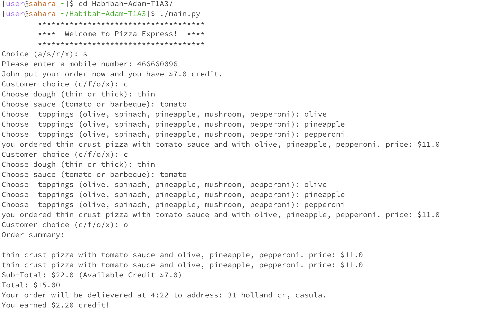
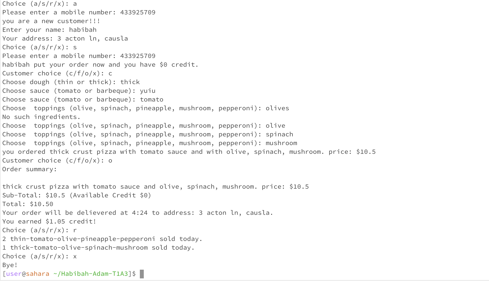
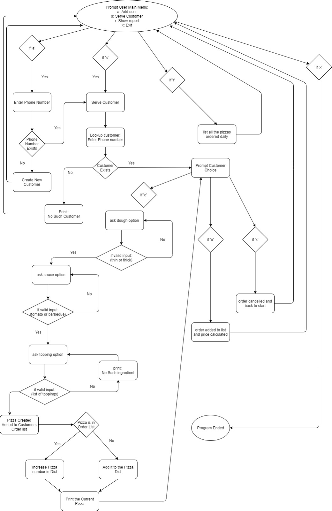

# Terminal application: Habibah_Adam

## Order Pizza Online

This application records a list of customers and allows for new customers to be added to this list. The customer's mobile is used as a unique identification througout the system. An order consistes of one or more pizzas and each pizza made from different ingredients, all of which can be chosen based on customer's wish. Each pizza created by cuatomers should be added to customers order, which allows customers to select the most popular pizza of the day. Finally, the total price of the order is calculated and shown(if the customer have credit, which should be applied to total). The of this order calculated and saved for next purchace. 

#### Code Execution:

## Main Features Implemented

- Maintains a list of customers
  - if exists in the list, return the customer
  - if not exist in the list, prompt option to add the new customer
- Allows to create pizza by:
  - Show options for crusts
  - Show options for sauces
  - Show options for toppings
- Calculate delivery time
  - Used Random minute between 15-25 minutes
- Award credit to customers based on pizza purchases
  - if credit is available, apply to the current purchase
- Reports daily transactions using a list of pizzas sold in a day
  - Prints out number of each pizzas sold 
  - Lists the pizzas in descending order

  ## Intended, but not accomplished

- minimum and maximum limit for choices of ingredients
- The customer is able to re_order a pizza from the past
- The list of past orders should be listed from most ordered pizza to least

## Flow Chart

